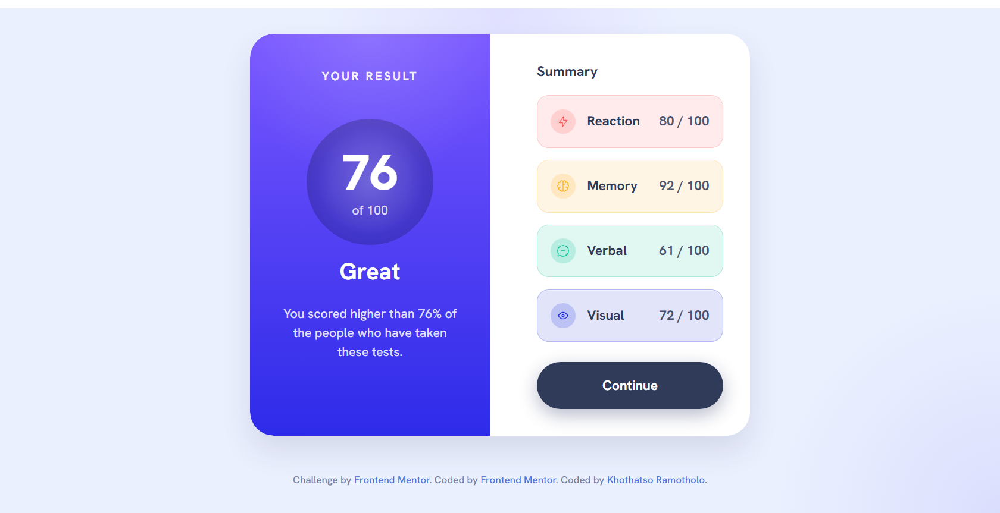

# Frontend Mentor - Results summary component solution

This repository contains a completed solution for the [Results summary component challenge on Frontend Mentor](https://www.frontendmentor.io/challenges/results-summary-component-CE_K6s0maV).

## Table of contents

- [Overview](#overview)
  - [The challenge](#the-challenge)
  - [Screenshot](#screenshot)
  - [Links](#links)
- [My process](#my-process)
  - [Built with](#built-with)
  - [What I learned](#what-i-learned)
  - [Continued development](#continued-development)
  - [Useful resources](#useful-resources)
- [Author](#author)
- [Acknowledgments](#acknowledgments)

## Overview

### The challenge

Users should be able to:

- View the optimal layout for the interface depending on their device's screen size
- See hover and focus states for all interactive elements on the page
- Use the local JSON data to dynamically populate the summary results
- Preserve quiz results using browser local storage

### Screenshot

### Links

- Solution URL: https://github.com/KhothatsoKay/results-summary-component-main
- Live Site URL: https://kr-resultssummary.netlify.app/

## My process

### Built with

- Semantic HTML5
- CSS custom properties
- Flexbox
- Responsive layout techniques
- Vanilla JavaScript
- Local JSON data handling
- Browser `localStorage`

### What I learned

This project helped me strengthen my understanding of dynamic DOM rendering with vanilla JavaScript. I used `fetch()` to load `data.json` and created a fallback dataset so the app still renders if the JSON load fails. I also implemented logic to calculate and display an average score and percentile message, plus local storage support for quiz results.

### Continued development

In future updates, I want to improve the project by adding:

- smoother transitions and hover interactions
- better form validation on the quiz page
- enhanced keyboard accessibility and focus states
- unit tests for score calculation and rendering logic

### Useful resources

- [Frontend Mentor challenge page](https://www.frontendmentor.io/challenges/results-summary-component-CE_K6s0maV) - challenge requirements and reference design
- [MDN Web Docs: Fetch API](https://developer.mozilla.org/en-US/docs/Web/API/Fetch_API) - used for loading local JSON data
- [MDN Web Docs: Web Storage API](https://developer.mozilla.org/en-US/docs/Web/API/Web_Storage_API) - used for persisting quiz results locally

## Author

- Website - Khothatso Ramotholo(https://khothatsocodetribe.netlify.app)

## Acknowledgments

- Thanks to Frontend Mentor for the design challenge and starter assets.
- The local data.json file and icon assets made it easy to build the summary dynamically.